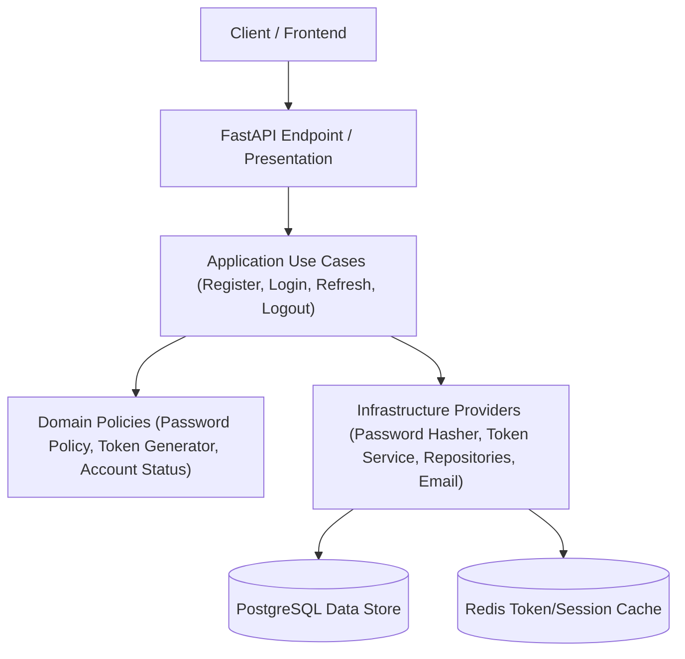

# InterviewIQ Authentication Architecture Specification

This document details the production authentication architecture, session management, token issuance, and password security policies for InterviewIQ.

## System Boundaries & Layers

## Authentication Lifecycle & Workflows

### 1. User Registration Workflow
1. Request payload validated (`email`, `password`, `first_name`, `last_name`).
2. Email normalized (lowercase, trimmed whitespace).
3. Email uniqueness verified safely via database repository.
4. Password policy evaluated against configuration parameters (`PASSWORD_MIN_LENGTH`, complexity rules).
5. User created (`account_status = 'PENDING_VERIFICATION'` or `'ACTIVE'` according to policy).
6. Password credential created using Argon2id hashing.
7. Cryptographically random one-time email verification token generated, hashed (SHA-256), and persisted.
8. `EmailProvider` dispatched to send delivery payload.
9. Security audit event logged (`auth.register`).

### 2. Login Workflow
1. Request email normalized and fetched.
2. Safe constant-time password verification executed via `PasswordHasher`.
3. Account status verified (`ACTIVE` or `PENDING_VERIFICATION`). Suspended or disabled accounts rejected with safe `AUTH_ACCOUNT_SUSPENDED` / `AUTH_INVALID_CREDENTIALS` error code.
4. New `UserSession` created with unique `family_id` UUID.
5. Cryptographically secure random refresh token generated, hashed (SHA-256), and stored in `user_sessions.current_token_hash`.
6. Short-lived Access Token (JWT, 15m expiration) signed and issued.
7. Security audit event logged (`auth.login_success` or `auth.login_failure`).
8. Access Token returned in JSON payload; Refresh Token set in `HttpOnly`, `Secure`, `SameSite=Lax` cookie.

### 3. Refresh Token Family Rotation & Reuse Detection Workflow
1. Client presents `refresh_token` in `HttpOnly` cookie.
2. Token hashed (SHA-256) and matched against `user_sessions`.
3. If token hash matches active session `current_token_hash` and `expires_at > NOW()` and `is_revoked == False`:
   - New refresh token generated.
   - Session updated: `current_token_hash = SHA256(new_refresh_token)`, `last_refreshed_at = NOW()`.
   - New short-lived access token issued.
   - New refresh token set in `HttpOnly` cookie.
4. **REUSE DETECTION TRIGGER**: If token hash is **stale** (a previously rotated refresh token from an active `family_id` is presented again):
   - **SECURITY INCIDENT DETECTED**: Indicates stolen or replayed refresh token.
   - **EMERGENCY FAMILY REVOCATION**: All sessions associated with `family_id` marked `is_revoked = True`, `revoked_reason = 'REUSE_DETECTED'`.
   - High-priority security audit log recorded (`auth.refresh_reuse_detected`).
   - Request rejected with `AUTH_SESSION_REVOKED`.
