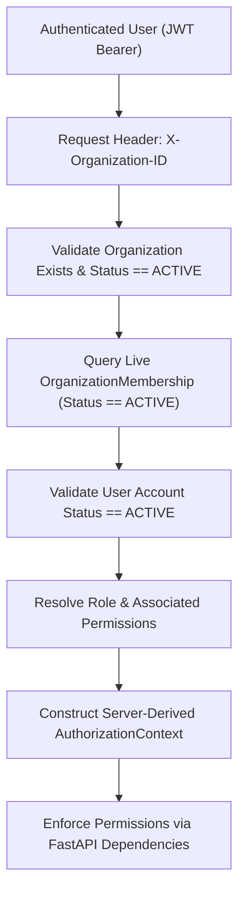

# InterviewIQ Authorization Architecture Specification

This document details the server-derived request authorization pipeline, active organization context resolution, candidate authorization boundaries, and permission resolution primitives.

## Server-Derived Authorization Pipeline

Authorization in InterviewIQ is strictly server-derived on every request. Client-provided JWT organization claims are **never** trusted as the sole source of truth.

## Authorization Primitives & FastAPI Dependencies

Authorization logic is decoupled from route handlers using reusable dependency primitives in `app/core/dependencies.py`:

- **`get_current_user`**: Validates JWT signature, expiration, and user account status (`ACTIVE`).
- **`get_active_org_context`**: Resolves requested `X-Organization-ID` against live database memberships and constructs `AuthorizationContext`.
- **`require_permission(permission_name)`**: Enforces that the resolved `AuthorizationContext` contains the specified granular permission string.
- **`require_candidate_access`**: Validates that a candidate user holds a valid `CandidateProfile` in the target organization.

## Candidate Access Boundaries vs. Organization Membership

Candidate users are **NOT** automatically organization members. 
- A candidate user participating in an interview holds a `CandidateProfile` tied to `organization_id`.
- The candidate authorization dependency verifies that `candidate_profile.organization_id == target_organization_id`.
- A candidate user holding candidate profiles in Organization A and Organization B cannot access Organization B resources when operating in Organization A context.
