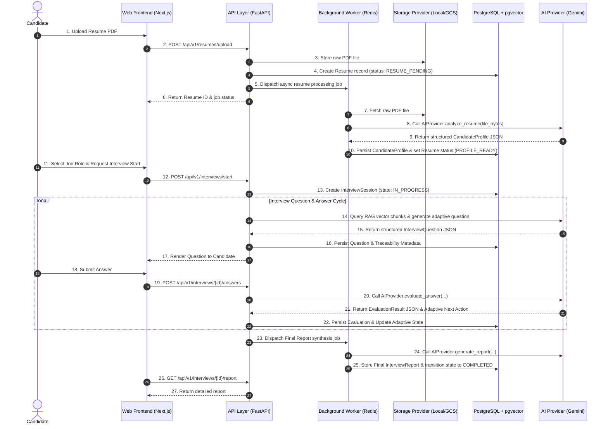

# InterviewIQ Data Flow Specification

This document details the end-to-end data processing pipelines across the InterviewIQ system, from candidate onboarding to final report synthesis.

## End-to-End Interview Data Pipeline



## Data Traceability Guarantees

Every generated question preserves explicit traceability context stored in `interview_questions.traceability_metadata`:

```json
{
  "question_id": "q_8f7b2a",
  "interview_session_id": "ses_9918a",
  "resume_signals": ["5 years Python", "FastAPI microservices", "Postgres optimization"],
  "target_role": "Senior Backend Engineer",
  "selected_topic": "Database Indexing & Query Optimization",
  "retrieved_chunks": [
    {
      "chunk_id": "chk_1042",
      "document_id": "doc_pg_perf",
      "similarity_score": 0.892,
      "section": "B-Tree vs GIN Indexes"
    }
  ],
  "difficulty": "HARD",
  "generation_strategy": "SCENARIO_BASED_DEBUGGING"
}
```
