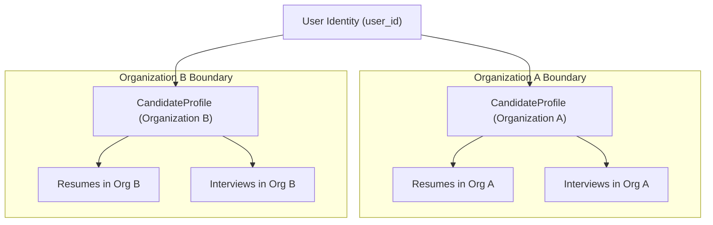

# InterviewIQ Data Ownership & Candidate Access Boundary Specification

This document details candidate identity separation, candidate access scenarios, and deletion retention classifications.

## Candidate Access Boundary Scenarios

InterviewIQ models candidates as `CandidateProfile` records owned by an `Organization`, with an optional link to a `User` identity account (`user_id`).

### Supported Candidate Workflows

1. **Candidate Self-Registration**: Candidate signs up on platform $\rightarrow$ `User` created $\rightarrow$ `CandidateProfile` created in target Organization with `user_id = user.id`.
2. **Recruiter-Created Candidate (No Login)**: Recruiter creates candidate profile manually $\rightarrow$ `CandidateProfile` created with `user_id = NULL`. Candidate can be interviewed without having a user account.
3. **Linking User to Existing Profile**: Recruiter invites candidate $\rightarrow$ Candidate accepts invitation $\rightarrow$ System sets `candidate_profile.user_id = candidate_user.id`.
4. **Multiple Organization Candidate Profiles**: A candidate `User` can participate in interviews across multiple independent recruitment organizations. The user holds distinct `CandidateProfile` records in Organization A and Organization B.
5. **Cross-Tenant Isolation Guarantee**: A candidate authenticated under Organization A context can **ONLY** access `CandidateProfile` records and `InterviewSession` records where `organization_id = Org_A_ID`. Having a profile in Organization B confers **ZERO** authorization to view Organization B data when authenticated in Organization A context.
6. **Candidate Access Revocation**: Archiving a candidate profile (`status = 'ARCHIVED'`) or unlinking `user_id` immediately revokes candidate portal access to those interview sessions without deleting historical interview records.

## Data Retention Classification

Entities are categorized into 4 strict retention tiers:

1. **Hard Deletable**: Ephemeral background job records older than 90 days, expired non-activated email verification tokens.
2. **Soft Deletable / Deactivatable**: `User` (`deleted_at`), `Organization` (`account_status = 'DELETED'`), `CandidateProfile` (`status = 'ARCHIVED'`), `JobRole` (`is_active = false`), `KnowledgeBase` (`status = 'ARCHIVED'`).
3. **Immutable Retention Records**: `InterviewSession`, `InterviewStateHistory`, `InterviewQuestion`, `CandidateAnswer`, `AnswerEvaluation`, `AdaptiveDecision`, `InterviewReport`, `AuditLog`.
4. **Controlled Deletion Workflows**: `Resume` (Requires explicit recruiter deletion request, unlinking storage key, and audit logging).
