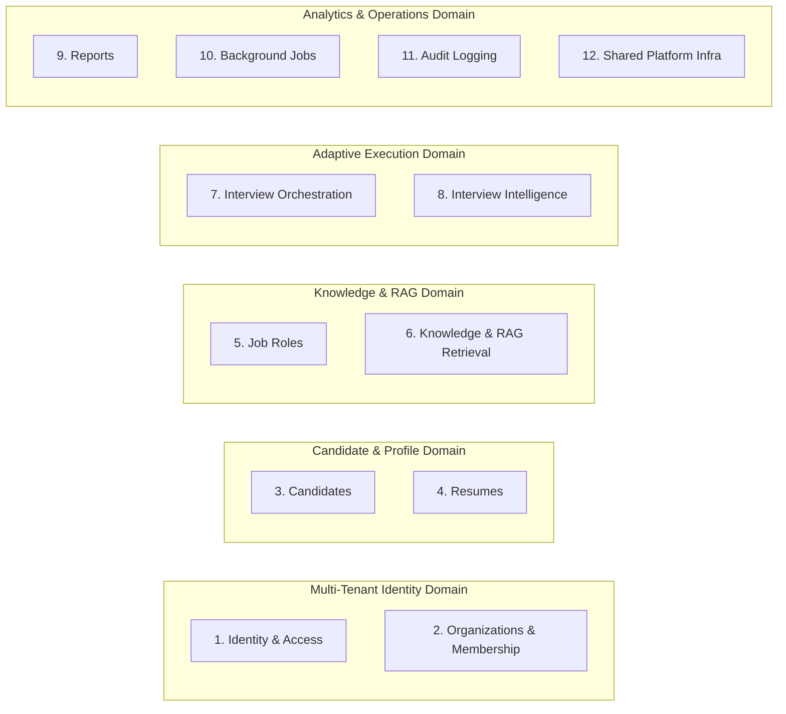

# InterviewIQ Domain Boundaries Specification

This document details the 12 consolidated bounded contexts constituting the InterviewIQ modular monolith architecture. Each module maintains strict isolation within `apps/api/app/modules/<module_name>`.

## Module Map & Boundary Definitions

## Detailed Module Responsibilities

| Module | Bounded Context Responsibility | Key Entities / Contracts |
|---|---|---|
| **1. Identity & Access** | Authentication, user management, JWT issuance, session revocation, RBAC policies, token hashing. | `User`, `UserSession`, `Role`, `AuthenticationProvider` |
| **2. Organizations & Membership** | Multi-tenant organization accounts, team memberships, recruiter invitations. | `Organization`, `Membership`, `OrganizationInvite` |
| **3. Candidates** | Candidate profile records, experience summaries, target role preferences. | `CandidateProfile`, `CandidateSkill` |
| **4. Resumes** | Upload validation, file storage reference, extraction job trigger, parsed resume JSON. | `Resume`, `ResumeExtractionResult` |
| **5. Job Roles** | Target technical job roles (e.g. Senior Backend Engineer), role requirements, competency matrices. | `JobRole`, `SkillRequirement` |
| **6. Knowledge & RAG Retrieval** | Document cataloging, structure-aware chunking, vector embedding, pgvector similarity retrieval. | `KnowledgeBase`, `DocumentChunk`, `VectorEmbedding` |
| **7. Interview Orchestration** | Master interview session state machine, session flow, sequence governance, timeout policies. | `InterviewSession`, `InterviewState` |
| **8. Interview Intelligence** | Grounded question generation, structured answer evaluation, dynamic adaptive difficulty engine. | `InterviewQuestion`, `EvaluationResult`, `AdaptiveState` |
| **9. Reports** | Comprehensive performance report compilation, competency heatmaps, candidate summaries. | `InterviewReport`, `SkillScore` |
| **10. Background Jobs** | Redis queue task dispatching, task tracking, retry mechanics for heavy processing. | `JobRecord`, `JobStatus` |
| **11. Audit Logging** | Immutable security logging for auth actions, score modifications, role assignments. | `AuditLog` |
| **12. Shared Platform Infra** | Cross-module database setup, base Pydantic models, exception handlers, AI and Storage interfaces. | `AIProvider`, `EmbeddingProvider`, `StorageProvider` |

## Strict Boundary Principles

1. **High Cohesion**: Merged `knowledge_bases` + `rag` into `knowledge_rag`, and `question_generation` + `answer_evaluation` + `adaptive_intelligence` into `interview_intelligence` to prevent fragmenting tightly coupled domain entities.
2. **No Direct Model Sharing**: Modules do not import SQLAlchemy ORM models of other modules. Inter-module communication occurs via application services or domain events.
