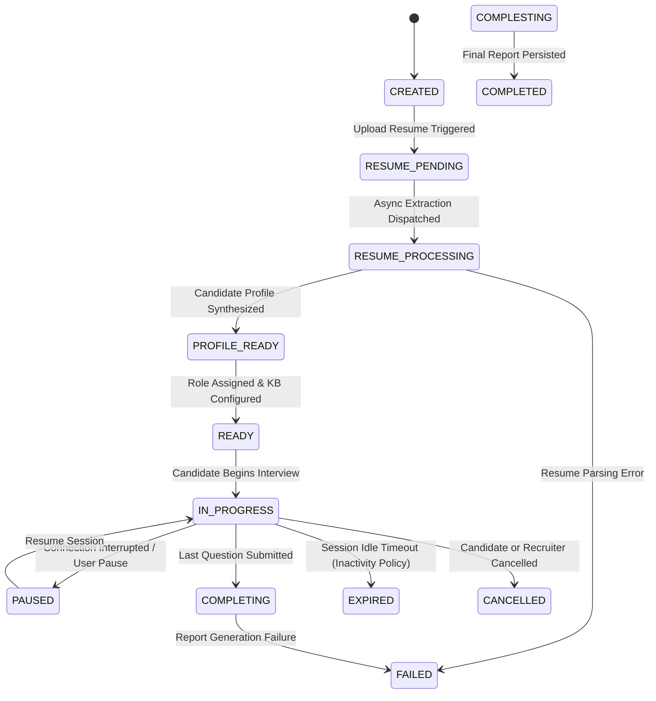

# InterviewIQ Lifecycle & State Machine Specification

This document details the backend-controlled state machine governing candidate interview sessions and explicit timeout policies.

## State Machine Transition Diagram

## Explicit Timeouts & Security Policy Matrix

InterviewIQ models 3 distinct, configuration-driven timeout and expiration policies:

| Policy | Configuration Variable | Default Value | Purpose & Governance |
|---|---|---|---|
| **Interview Inactivity Timeout** | `INTERVIEW_INACTIVITY_TIMEOUT_MINUTES` | `30` mins | Automatically marks active interview as `EXPIRED` if no candidate activity occurs within window. |
| **Maximum Interview Duration** | `INTERVIEW_MAX_DURATION_MINUTES` | `90` mins | Hard ceiling for total interview duration from initial `IN_PROGRESS` transition. |
| **Auth Session Expiration** | `ACCESS_TOKEN_EXPIRE_MINUTES` / `REFRESH_TOKEN_EXPIRE_DAYS` | `60` mins / `7` days | Governs JWT credential validity and refresh token rotation lifecycle. |

## Interruption Recovery & Timer Enforcement Rules

1. **State Persistence**: The backend updates state transactionally in PostgreSQL before returning HTTP responses.
2. **Idempotent Question Recovery**: If a candidate reloads their browser mid-question, the API re-serves the active un-answered `InterviewQuestion` from DB without calling Gemini again.
3. **Dynamic Inactivity Evaluation**: Every candidate interaction updates `last_activity_at`. Background worker checks active sessions where `NOW() - last_activity_at > INTERVIEW_INACTIVITY_TIMEOUT_MINUTES` and transitions state to `EXPIRED`.
