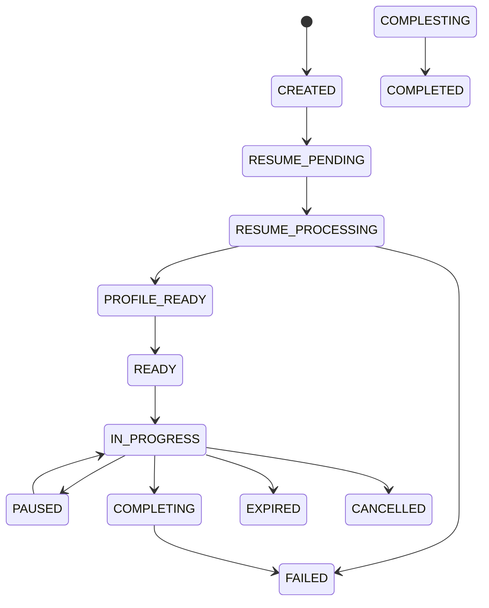

# InterviewIQ Interview Persistence & State Machine Specification

This document details the backend-controlled persistence architecture for interview sessions, questions, evaluations, and state transition auditing.

## Session State Persistence & Optimistic Locking

All interview session state transitions are stored in `interview_sessions` and governed by PostgreSQL enums and optimistic concurrency versioning (`version_number`).

```sql
CREATE TYPE interview_session_status AS ENUM (
    'CREATED',
    'RESUME_PENDING',
    'RESUME_PROCESSING',
    'PROFILE_READY',
    'READY',
    'IN_PROGRESS',
    'PAUSED',
    'COMPLETING',
    'COMPLETED',
    'FAILED',
    'CANCELLED',
    'EXPIRED'
);
```



## Immutable Audit Trail: `interview_state_history`

Every state transition writes an immutable audit record to `interview_state_history`:

```sql
CREATE TABLE interview_state_history (
    id UUID PRIMARY KEY DEFAULT gen_random_uuid(),
    interview_session_id UUID NOT NULL REFERENCES interview_sessions(id) ON DELETE CASCADE,
    previous_status VARCHAR(50) NOT NULL,
    new_status VARCHAR(50) NOT NULL,
    transition_reason VARCHAR(150) NOT NULL,
    actor_type VARCHAR(50) NOT NULL, -- CANDIDATE, RECRUITER, SYSTEM, WORKER
    actor_id UUID,
    metadata_json JSONB,
    created_at TIMESTAMPTZ NOT NULL DEFAULT NOW()
);

CREATE INDEX idx_interview_state_history_session 
ON interview_state_history (interview_session_id, created_at);
```

## Question & Evaluation Provenance

Every generated question persists detailed RAG and resume provenance in `interview_questions.traceability_metadata`:

```json
{
  "resume_signals_used": ["5 years Python", "Postgres optimization"],
  "job_role_requirements_used": ["Senior Backend Engineer", "Database Performance"],
  "retrieved_chunk_ids": ["chk_8f1a", "chk_9c2b"],
  "retrieval_query_vector_model": "gemini-embedding-2",
  "ai_provider": "gemini",
  "ai_model": "gemini-2.5-flash",
  "prompt_version": "v1.2"
}
```
