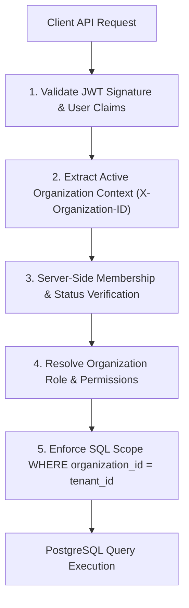

# InterviewIQ Multi-Tenancy Architecture Specification

This document details the multi-tenant SaaS resource isolation, organization membership governance, and multi-stage authorization pipeline enforced in InterviewIQ.

## Multi-Tenant SaaS Isolation Model

InterviewIQ enforces **Pooled Multi-Tenancy with Row-Level Tenant Scoping**. All tenants share the same PostgreSQL database cluster, with strict `organization_id` foreign key columns and query-level tenant filters enforcing complete data isolation.

## Multi-Stage Authorization Pipeline Requirements

A verified JWT alone is **NOT** the sole source of truth for tenant authorization. The backend enforces a 5-stage authorization pipeline:

1. **User Identity Verification**: Validate JWT signature, token expiration, and session revocation status (Redis `jti` revocation list).
2. **Organization Context Selection**: Extract requested organization ID from `X-Organization-ID` header (or route parameter).
3. **Live Membership Lookup**: Query `organization_memberships` (cached in Redis) to verify:
   - User has an active membership (`status = 'ACTIVE'`) in the target organization.
   - Target organization is active (`account_status = 'ACTIVE'`).
4. **Role & Permission Resolution**: Map user's organization role to granular permissions. If the user's role was revoked or changed, the live database check immediately denies access regardless of stale JWT claims.
5. **Server-Side Ownership Enforcement**: Every SQL query appends `organization_id = active_organization_id`. Client attempts to query resources across tenant boundaries are blocked at the database query layer.

## Resource Ownership & Foreign Key Deletion Matrix

| Entity | Tenant FK (`organization_id`) | FK Deletion Behavior | Retention Classification |
|---|---|---|---|
| `Organization` | Primary Key | N/A | Soft Deletable (`account_status = 'DELETED'`) |
| `User` | N/A (Global Entity) | N/A | Soft Deletable (`deleted_at IS NOT NULL`) |
| `OrganizationMembership` | Mandatory FK | `ON DELETE CASCADE` | Controlled Workflow (Revoked status) |
| `CandidateProfile` | Mandatory FK | `ON DELETE RESTRICT` | Soft Deletable (`status = 'ARCHIVED'`) |
| `Resume` | Mandatory FK | `ON DELETE RESTRICT` | Controlled File Deletion Workflow |
| `JobRole` | Optional FK (NULL = Global) | `ON DELETE RESTRICT` | Versioned Deactivation (`is_active = false`) |
| `KnowledgeBase` | Mandatory FK | `ON DELETE RESTRICT` | Soft Deletable (`status = 'ARCHIVED'`) |
| `InterviewSession` | Mandatory FK | `ON DELETE RESTRICT` | Immutable Retention Record |
| `InterviewQuestion` | Derived via Session | `ON DELETE CASCADE` | Immutable Retention Record |
| `CandidateAnswer` | Derived via Question | `ON DELETE CASCADE` | Immutable Retention Record |
| `AnswerEvaluation` | Derived via Answer | `ON DELETE CASCADE` | Immutable Retention Record |
| `InterviewReport` | Derived via Session | `ON DELETE CASCADE` | Immutable Retention Record |
| `BackgroundJob` | Mandatory FK | `ON DELETE SET NULL` | Ephemeral / Audited Job Record |
| `AuditLog` | Mandatory FK | `ON DELETE SET NULL` | Immutable Append-Only Audit Trail |
