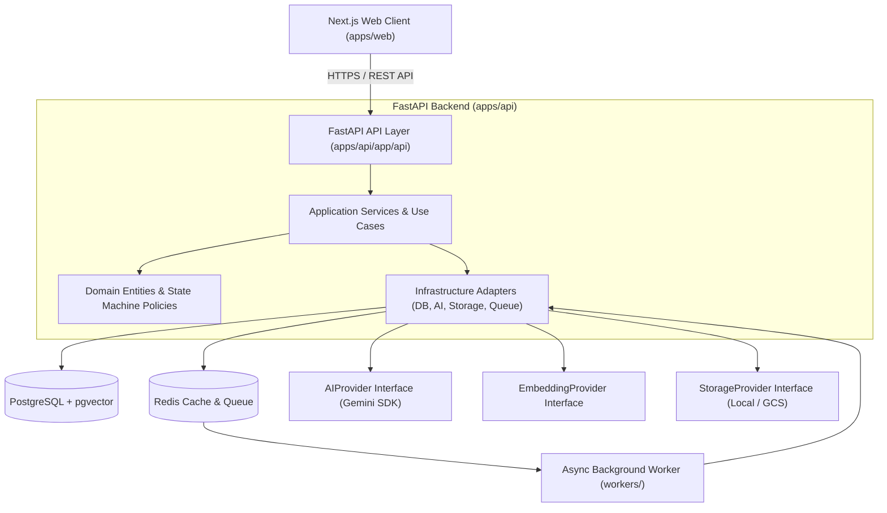

# InterviewIQ System Overview Specification

## Executive Architecture Summary

InterviewIQ is an enterprise-ready, AI-powered adaptive technical interview platform. The application is built as a **Modular Monolith** using FastAPI (Python) and Next.js (TypeScript), backed by PostgreSQL + pgvector for transactional state and model-aware vector similarity search, and Redis for caching and asynchronous queue management.

The architecture emphasizes domain boundary isolation across 12 cohesive bounded contexts, multi-tenant organization readiness, strict backend state machine governance, traceably grounded RAG context retrieval, model-aware vector embeddings, configuration-driven timeout policies, and structured AI response evaluation.

## Architectural Design Principles

1. **Modular Monolith First**: Single deployable backend artifact containing strictly bounded logical modules (`identity`, `candidates`, `interviews`, `knowledge_rag`, `interview_intelligence`, etc.). Modules communicate across application service boundaries, not direct cross-module DB table mutations.
2. **Backend-Governed State**: The backend API strictly owns and validates all interview state transitions, question flows, evaluation scores, and candidate progression. The frontend is purely a presentation layer.
3. **Model-Aware Embedding Layer**: Vector embedding generation is abstracted via `EmbeddingProvider`. Embeddings store explicit model metadata (`embedding_provider`, `embedding_model`, `embedding_dimension`, `embedding_version`) and pgvector table schemas are dynamically configured via environment settings (`EMBEDDING_DIMENSION`).
4. **Configuration-Driven Lifecycle Policies**: Timeouts are decoupled into explicit environment policies:
   - `INTERVIEW_INACTIVITY_TIMEOUT_MINUTES`
   - `INTERVIEW_MAX_DURATION_MINUTES`
   - `ACCESS_TOKEN_EXPIRE_MINUTES` & `REFRESH_TOKEN_EXPIRE_DAYS`
5. **Traceable Grounded RAG**: Questions generated during interviews maintain explicit traceability metadata: candidate profile attributes, target role requirements, retrieved knowledge base chunks (with similarity scores), and dynamic difficulty policies.
6. **Multi-Tenant SaaS Security**: Data models enforce organization boundaries (`organization_id`) and role-based authorization policies (Candidate, Recruiter, Org Admin, Platform Admin).
